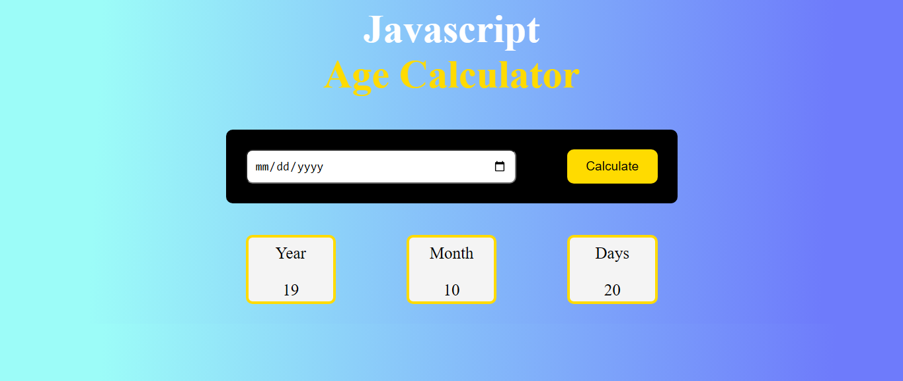

# 🎂 Age Calculator Web App

A simple and interactive **Age Calculator** built with **HTML**, **CSS**, and **JavaScript**. Enter your date of birth and instantly find your age in years, months, and days.

---

## 🌐 Live Demo

🔗 [Try it Now](https://mubeen2005.github.io/Age-Calculator/)

---

## 🖼️ Preview

  

---

## 🧰 Tech Stack

- 🧱 HTML5 – Structure of the app
- 🎨 CSS3 – Modern and responsive design
- ⚙️ JavaScript – Age calculation logic, date handling

---

## ✨ Features

- ✅ Input date of birth using a calendar picker
- 🧠 Calculates:
  - Current age in years, months, and days
- 📱 Fully responsive layout
- 🎯 Clean and minimal UI
